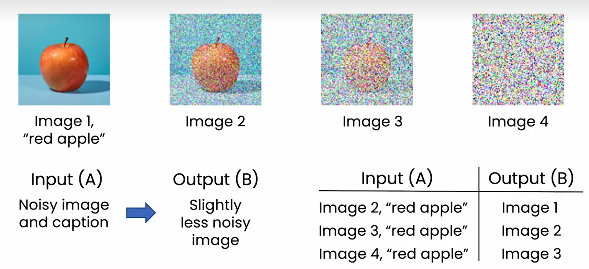
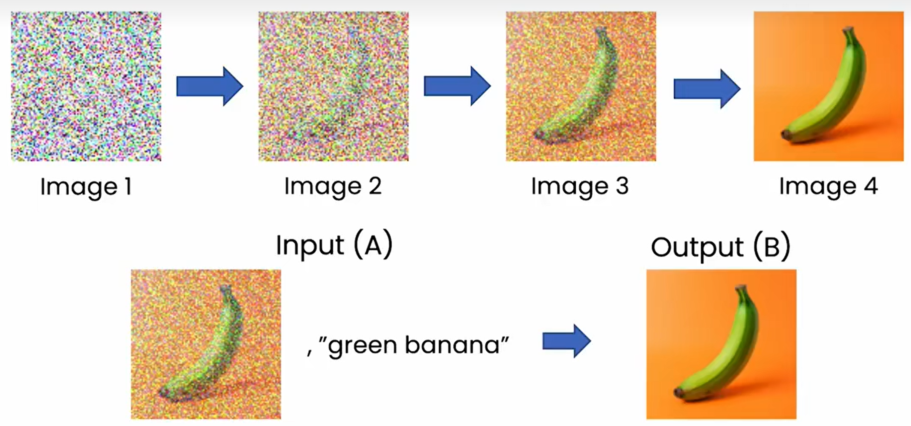
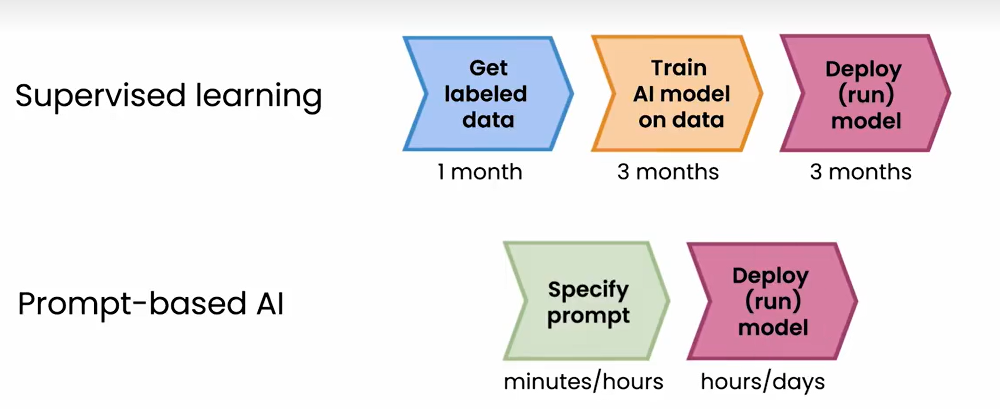
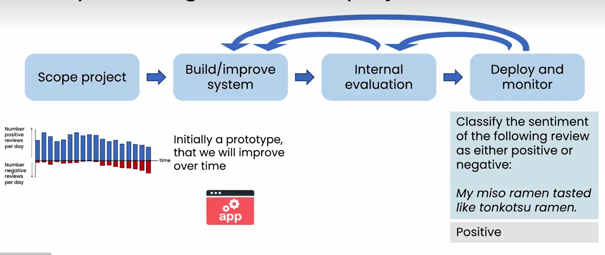
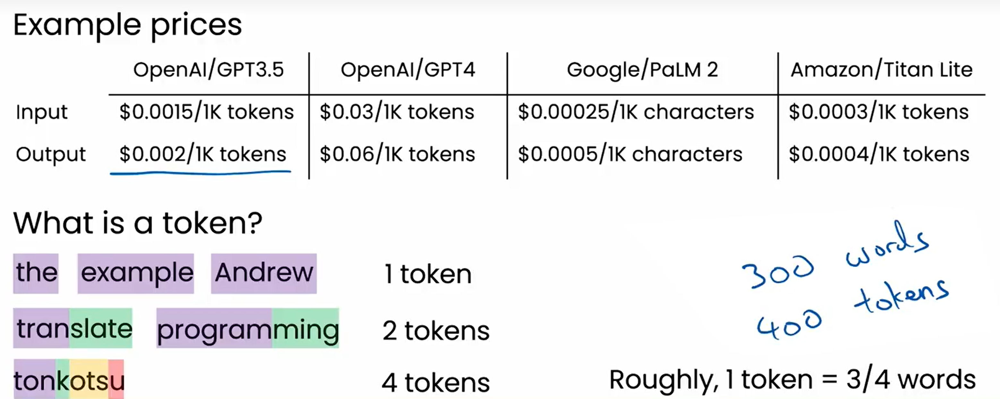
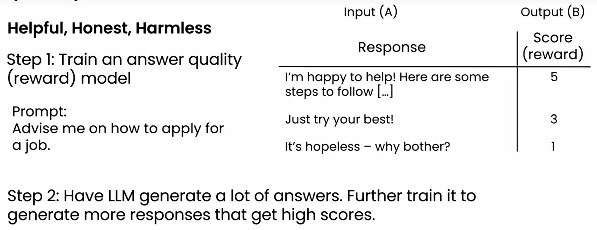

# 1
小模型：随着数据量增加，性能会达到上限  
大模型：性能随着数据量增加增强  
大指的更好的更快的电脑，更大的内存  
10~20年，大模型的发展  

LLM通过监督学习构建，将文章数据拆分为prompt（input）跟output，用于预测语句的下一段话  

# 2
llmy有时候会编造事实，称为hallucination幻觉  

# 3
LLM是一种通用技术，不专注于特定内容，类似电力  
写作、阅读、聊天机器人  

# 4
利用prompt提示，生成文章，输入短输出长  
也可以用来翻译  

# 5
输入长输出短  
阅读文章找出语法错误  
阅读并总结文章  

# 6
赋予bot处理权利以及阅览数据权利可以扩张功能  
1. 全人工
2. 机器辅助人类 bots support humans（human-in-the-loop）
3. 机器分类后一部分转人工 bot triages for humans
4. 全机器

开发建议  
1. 先从内部机器人开始
2. 后面引入人工检查机器生成回复
3. 最后允许机器聊天

# 7
可以把llm想象成刚毕业的大学生  
- 不能使用网络或者其他资源
- 没有经过针对公司或商业的训练
- 无法记住之前完成的任务

## knowledge cutoff
LLM的知识被冻结在被训练完成的时间点  
## hallucination
llm会胡编乱造  
## 输入与输出的长度受到限制
- 大部分只能接受最多几千词的prompt  
## 结构化数据
不擅长梳理结构化数据（sql）  
擅长处理非结构化数据像文本、图像、音频、视频  
## 带偏见的或者有害言论

# 8  
## 建议  
- 详细与具体  
- 引导模型思考答案  
  1. 想象为什么不是期望的输出  
  2. 修改prompt  
  3. 重复  
  
  注意点⚠️  
  1. 机密信息  
  2. 是否信任llm的输出  

- 实验与迭代  

# 9
扩散模型 diffusion model  
训练：模糊模型与描述➡️没那么模糊的模型 

  

  

# 10
使用LLM开发会快很多  

  

# 12

  

构建生成式AI软件是一个高度实验性的过程，这意味着反复尝试某事，发现并纠正错误  

- Retrieval augmented generation(RAG)  
  使得大模型可以访问外部数据  
- fine-tune models  
  微调大模型，适应特殊需求  
- pretrain models 预训练模型  
  从头训练一个大语言模型

# 13
使用大语言模型费用非常便宜  
使用token计费，一个英语单词大概可以被视作4/3个token  

  

# 14 RAG
允许llm访问内部文件，那么输入prompt后，llm会在内部文件里搜索  
相关应用：读取pdf内容生成简介  

把LLM当做一个推理引擎，而不是知识库  
- LLM有很多通用知识但不知道所有事情  
- 在prompt提供相关信息，引导llm得到答案  
- 使用推理来获得答案而不是单纯的知识库  

# 15
fine-tuning通过追加学习，使得模型可以输出不一样的答案  
例子：使得LLM变得更加乐观  

## 为什么要微调？  
- 有些任务不容易在prompt里面定义  
例子：客服呼叫中心使用LLM总结，但希望输出里面有更加详细的内容  
- 模仿特定书写或者说话方式  
例子：使得LLM语气像某个人或者某个卡通角色  
- 帮助LLM获取特定领域知识  
例子：使得LLM可以处理医学、法律、财务文件  
- 压缩LLM使其可以在小型设备上运行  
问题：响应慢  

# 18
## instruction tuning
LLM本身只是预测句子下一个单词，但使用这个技术使得LLM按照你的prompt输出答案  
本质是使用一组期待结果的数据来给llm做fine-tuning  

# RLHF - Reinforcement learning from hunman feedback  
很多公司训练LLM希望是3H（helpfun、honest、harmless）的  

1. 训练一个模型来评价llm的答案  
2. 使用这个模型来评估，让llm输出分数更高的答案  

  

先使其能按照指示生成答案，再使其能生成高质量的答案  
