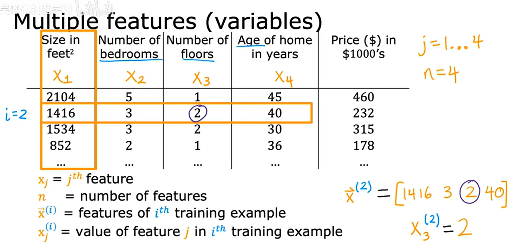
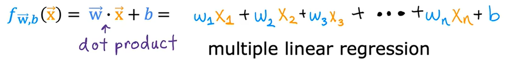
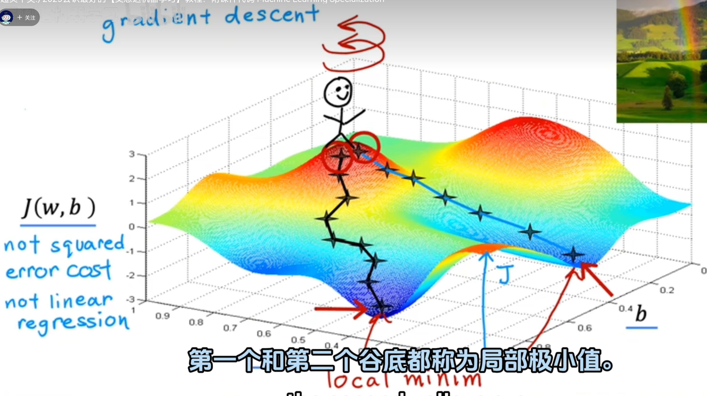

# 1.1
机器学习的应用：广告推送、图像识别、医学诊断辅助。。。  
# 1.2
# 2.1
使用频率：监督学习（90%以上） -> 非监督学习 -> 强化学习  
# 2.2
回归 regression：从无数可能数字中预测一个数字  
# 2.3
分类 classification：在有限的结果里预测其中一个  
# 2.4
unsupervised learning: find something interesting in unlabeled data  
clustering 聚类: put unlabeled data into different clusters  
应用：google news、人类基因组分类、给予数据将客户分类  
# 2.5
anomaly detection: find unusual data points  
输入一堆邮件数据，让算法自己分类  
输入金融数据，检测异常  
# 2.6
# 2.7
linear regression 线性回归：为数据拟合一条直线  
trainnig set: 用于训练模型  
x：输入  
y：输出  
m：训练数据量  
(x,y)：单个训练数据  
(x(i),y(i))：第i个数据  
# 2.8
$\hat{y}$：y的估计或预测  
y：训练集中的真实值  
f：模型  

|General     Notation   | Description| Python (if applicable) |
|:------------|:------------------------------------------------------------|----|
| $a$ | scalar, non bold                                                      ||
| $\mathbf{a}$ | vector, bold                                                      ||
| **Regression** |         |    |     |
|  $\mathbf{x}$ | Training Example feature values | `x_train` |   
|  $\mathbf{y}$  | Training Example targets  | `y_train` 
|  $x^{(i)}$, $y^{(i)}$ | $i_{th}$Training Example | `x_i`, `y_i`|
| m | Number of training examples | `m`|
|  $w$  |  parameter: weight,                                 | `w`    |
|  $b$           |  parameter: bias                                           | `b`    |     
| $f_{w,b}(x^{(i)})$ | The result of the model evaluation at $x^{(i)}$ parameterized by $w,b$: $f_{w,b}(x^{(i)}) = wx^{(i)}+b$  | `f_wb` | 

# 3.3
parameter参数：也被叫做 coefficient系数 或 weight权重  
cost function 成本函数：用来衡量模型拟合程度的函数   
error 误差：预测值与实际值的差距  

# 3.4
n：参数维度数量  
 

  

 

  

# 3.5
1维：笑脸状函数  
2维：碗状函数  

等高图：loss一样的点，想象一下山的等高图  

# 3.6
👆的具体例子  

# 4.1 梯度下降
squared error cost function（平方误差代价函数）：指MSE  
对于具有平方误差代价函数的线性回归，函数总是呈弓形或者吊床形  
但在实际情况中，可以有多个低谷，叫做局部极小值 local minima  

  

### 4.2 实现梯度下降
假设loss函数是二维的，有 $w, b$ 两个参数  
则参数以以下的方式更新  

$$
\begin{aligned}
w^{(t+1)} &= w^{(t)} - \alpha\ \frac{\partial J(w^{(t)}, b^{(t)})}{\partial w},\\
b^{(t+1)} &= b^{(t)} - \alpha\ \frac{\partial J(w^{(t)}, b^{(t)})}{\partial b},
\end{aligned}
$$
$ α $：学习速率（learning rate）  
$ t $：参数更新次数  
$  J(w^{(t)}, b^{(t)}) $：损失函数  

注意各个参数必须**同时**更新，不能现更新$ w $再更新$ b $  

### 4.3 梯度下降的直观理解
导数是斜率，斜率越高移动的速度越快，斜率低移动慢  
在函数底部左边时，斜率为正向右移动，在右边时向左移动  