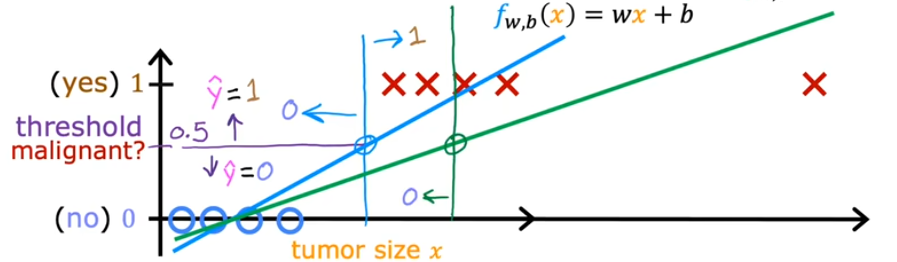
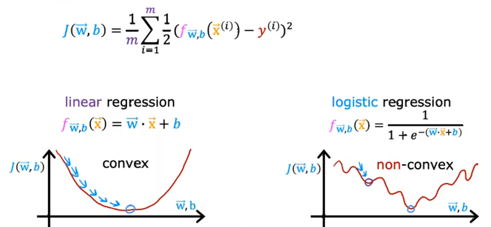
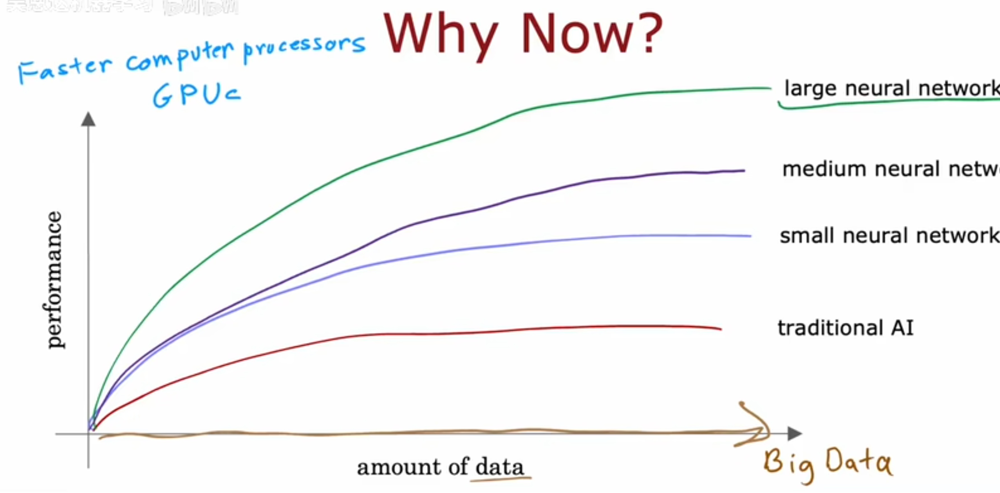

# 1
## 1
### 1.1
机器学习的应用：广告推送、图像识别、医学诊断辅助。。。  
### 1.2

## 2
### 2.1
使用频率：监督学习（90%以上） -> 非监督学习 -> 强化学习  
### 2.2
回归 regression：从无数可能数字中预测一个数字  
### 2.3
分类 classification：在有限的结果里预测其中一个  
### 2.4
unsupervised learning: find something interesting in unlabeled data  
clustering 聚类: put unlabeled data into different clusters  
应用：google news、人类基因组分类、给予数据将客户分类  
### 2.5
anomaly detection: find unusual data points  
输入一堆邮件数据，让算法自己分类  
输入金融数据，检测异常  
### 2.6
### 2.7
linear regression 线性回归：为数据拟合一条直线  
trainnig set: 用于训练模型  
x：输入  
y：输出  
m：训练数据量  
(x,y)：单个训练数据  
(x(i),y(i))：第i个数据  
### 2.8
$\hat{y}$：y的估计或预测  
y：训练集中的真实值  
f：模型  

|General     Notation   | Description| Python (if applicable) |
|:------------|:------------------------------------------------------------|----|
| $a$ | scalar, non bold                                                      ||
| $\mathbf{a}$ | vector, bold                                                      ||
| **Regression** |         |    |     |
|  $\mathbf{x}$ | Training Example feature values | `x_train` |   
|  $\mathbf{y}$  | Training Example targets  | `y_train` 
|  $x^{(i)}$, $y^{(i)}$ | $i_{th}$Training Example | `x_i`, `y_i`|
| m | Number of training examples | `m`|
|  $w$  |  parameter: weight,                                 | `w`    |
|  $b$           |  parameter: bias                                           | `b`    |     
| $f_{w,b}(x^{(i)})$ | The result of the model evaluation at $x^{(i)}$ parameterized by $w,b$: $f_{w,b}(x^{(i)}) = wx^{(i)}+b$  | `f_wb` | 

## 3
### 3.3
parameter参数：也被叫做 coefficient系数 或 weight权重  
cost function 成本函数：用来衡量模型拟合程度的函数   
error 误差：预测值与实际值的差距  

### 3.4
n：参数维度数量  
 

  

 

  

### 3.5
1维：笑脸状函数  
2维：碗状函数  

等高图：loss一样的点，想象一下山的等高图  

### 3.6
👆的具体例子  

## 4
### 4.1 梯度下降
squared error cost function（平方误差代价函数）：指MSE  
对于具有平方误差代价函数的线性回归，函数总是呈弓形或者吊床形  
但在实际情况中，可以有多个低谷，叫做局部极小值 local minima  

  

### 4.2 实现梯度下降
假设loss函数是二维的，有 $w, b$ 两个参数  
则参数以以下的方式更新  

$$
\begin{aligned}
w^{(t+1)} &= w^{(t)} - \alpha\ \frac{\partial J(w^{(t)}, b^{(t)})}{\partial w},\\
b^{(t+1)} &= b^{(t)} - \alpha\ \frac{\partial J(w^{(t)}, b^{(t)})}{\partial b},
\end{aligned}
$$
$ α $：学习速率（learning rate）  
$ t $：参数更新次数  
$  J(w^{(t)}, b^{(t)}) $：损失函数  

注意各个参数必须**同时**更新，不能现更新$ w $再更新$ b $  

### 4.3 梯度下降的直观理解
导数是斜率，斜率越高移动的速度越快，斜率低移动慢  
在函数底部左边时，斜率为正向右移动，在右边时向左移动  

### 4.4 学习率
太小收敛会需要很长的时间  
太常会左右横跳无法收敛  
收敛：损失函数或目标函数达到最小值或近似不再变化，参数更新非常小，模型性能基本不再提升  

### 4.5 线性回归中的梯度下降
梯度下降公式推导  

## 5
### 5.1 多类特征
$x_j$（x subscript j）：第j个特征  
$n$：特征数量  
$\vec{x}^{(i)}$（x superscript i）：第i个样本的特征集合  
$x^{(i)}_j$：第i个样本第j个特征  
GPU计算方法：向量点乘  

### 5.2 向量化 part1
- 代码更简洁、高效  
- 使用现代数值线性代数库
- 调用gpu  

向量点积`np.dot(x,w)`

### 5.3 向量化 part2

## 6
### 6.1 feature scaling 特征缩放 part1
当一个特征可能取值很大时（300～2000），参数的合理值比较小  
当一个特征可能取值很小时（1～5），参数的合理值比较大  
导致不同特镇对于损失函数的影响不同，梯度下降很难收敛  
所以需要特征缩放来使得各个特征取值范围相同  

### 6.2 feature scaling 特征缩放 part2
- 最简单方法
  直接将值除以最大值  

- mean normalization 均值归一法  
  使得大多数数据在(-1,1)的区间内  
  $$
  x_{\text{norm}} = \frac{x - \mu}{x_{\max} - x_{\min}}
  $$
  $\mu$为平均值  

- z-score normalization z-score归一法   
  作用是使数据均值为0、标准差为1  
  $$
  x_{\text{norm}} = \frac{x - \mu}{\sigma}
  $$
  其中 $x$ 是原始值，$\mu$ 是均值，$\sigma$ 是每个特征的标准差 standand deciation  

目标是使得大部分数据分布在(-1,1)的区间，但稍微超过一点点影响不大  

### 6.3 检查梯度下降是否收敛
学习曲线：loss/epoch  
如果学习途中loss上升，通常说明alpha太大或者有bug  

Automatic convergence test  
每次参数更新后，计算损失函数 $J$ 的变化量，如果连续几次迭代中损失函数的变化小于某个很小的阈值（如 $10^{-3}$（10 to the power of negative 3） 或 $10^{-4}$），就认为算法已经收敛  

### 6.4 学习率的选择
太小：收敛得很慢  
太大：无法收敛  
如果loss没有下降，试着将alpha设置为一个很小的值，如果这样也无法下降的话通常说明有bug  
使用少量的epoch测试一系列的学习率，选出一个能快速降低loss的再开始学习  

### 6.5 特征工程 feature engineering
使用对问题的知识或直觉，通过转换或者结合原有特征来设计新特征，使学习算法更容易作出正确的预测  

### 6.6 多项式回归 Polynomial regression
创造幂次特征（$x^2$、$x^3$、$\sqrt{x}$）后，特征缩放会变得越来越重要

## 7
### 7.1 motivations
在分类问题里，线性回归不如逻辑回归  

  

蓝线：一开始的线性回归  
绿线：加入最右边新点后的线性回归  
紫线：设置一个阈值，低于阈值预测为no反之为yes  
加入最右边新点后，新的模型不能很好的预测  

### 7.2 逻辑回归 logistic regression
sigmoid(logistic) function: 将任意实数映射到 (0, 1) 区间，输出可以解释为概率，帮助模型进行二分类预测  
$$
\sigma(z) = \frac{1}{1 + e^{-z}}
$$
将sigmoid接在模型的输出后面  
被解读为y等于1的概率  

### 7.3 决策边界 decision boundary
使用高级多项式可以创造复杂的决策边界来拟合数据  

## 8
### 1 逻辑回归的代价函数

  

线性回归使用的平方差代价函数在逻辑回归会存在很多局部最小值  

$$
J(w, b) = -\frac{1}{m} \sum_{i=1}^m \left[ y^{(i)} \log(\hat{y}^{(i)}) + (1 - y^{(i)}) \log(1 - \hat{y}^{(i)}) \right]
$$

其中：

- $J(w, b)$：整体损失函数
- $m$：样本总数
- $y^{(i)}$：第$i$个样本的真实标签
- $\hat{y}^{(i)}$：第$i$个样本的预测概率
- $w, b$：模型参数

## 10
### 1 过拟合的问题  
过拟合（Overfitting）是指机器学习模型在训练数据上表现很好，但在新数据（测试集或实际应用中）表现很差的现象。  
其原因是模型把训练数据中的噪声或偶然性当成了规律，导致模型过于复杂、泛化能力差。  

### 2 解决过拟合
1. 增加数据数量
2. 减少特征数量  
   特征数多而数据少会引起国拟合  
   只选取少量的特征可以解决  
   但缺点是有些信息会丢失而这些信息有可能对于预测结果有用  
3. 正则化 regularization

### 3 正则化代价函数
L1正则化（Lasso）：在损失函数中加入参数绝对值之和作为惩罚项  
$$ J(w, b) = \text{原损失} + \lambda \sum_{j=1}^n |w_j| $$  
这样可以促使部分参数变为0，实现特征选择。  

L2正则化（Ridge）：在损失函数中加入参数平方和作为惩罚项  
$$ J(w, b) = \text{原损失} + \lambda \sum_{j=1}^n w_j^2 $$  
这样可以让参数变小但不为0，使模型更平滑、减少过拟合。  

$\lambda$（lambda）是正则化系数或正则化强度  
$\lambda$ 越大，正则化作用越强，模型参数被压缩得越小，可能导致欠拟合。  
$\lambda$ 越小，正则化作用越弱，更容易过拟合。  

### 4 正则化线性回归
skip  

### 5 正则化逻辑回归
skip

# 2
## 1
### 1 高级学习算法
课程简介  

使用神经网络进行预测prediction也被叫做推理inference  

### 2 神经元和大脑
一开始是尝试模仿大脑的算法，现在已经没有太大关系  

为何是现在？  
- 互联网的崛起积累了大量数据，使得神经网络的表现超过了传统ai算法  
- GPU崛起  

  

### 3 需求预测
并列的神经元被层为层（layer），分为input layer、hidden layer、output layer  
神经元内部的值叫激活值（activation values）  
多层神经元可以理解为自动化特征工程  