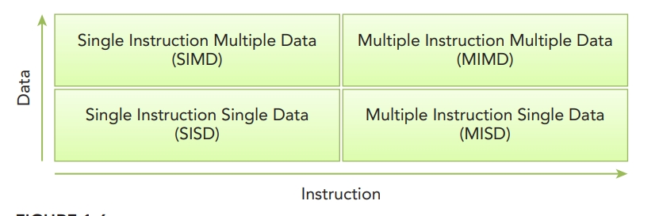

2 fundamental types of parallelism  
- Task parallelism  
  Many tasks or functions that can be operated independently and largely in parallel. Focuses on distributing functions across multiple cores.  
- Data parallelism  
  many data items that can be operated on at the same time. Data parallelism focuses on distributing the data across multiple cores

2 approaches to partitioning data
- block partitioning  
  连续的数据元素被分成一块块，每块分配给一个线程，顺序可以任意，线程通常一次只处理一个块  
- cyclic partitioning  
  分成的块较少，邻近的线程接收相邻的块，每个线程可以处理多个块。为一个线程选择一个新的块进行处理意味着跳过与线程数量相同的块。

Flynn’s Taxonomy Computer Architecture  

  

advances  
- Decrease latency  
  time it takes for an operation to start and complete, and is commonly expressed in microseconds  
- Increase bandwidth  
  amount of data that can be processed per unit of time, commonly expressed as megabytes/sec or gigabytes/sec  
- Increase throughput  
  amount of operations that can be processed per unit of time, commonly expressed as gflops(billion floating-point operations per second)  

2 types of memory organization
- Multi-node with distributed memory
  
- Multiprocessor with shared memory
